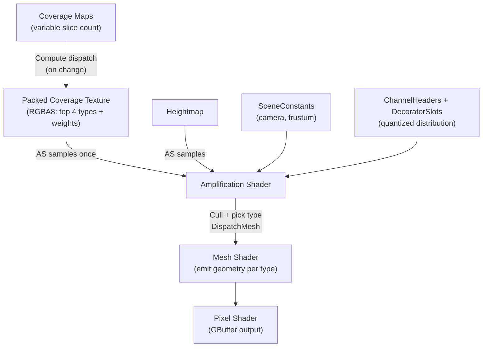

# Mesh Shader Implementation for TerrainDecorator

Implement mesh shader support in the Freefall engine, starting with `TerrainDecorator` as a proof of concept. Modern AS→MS→PS pipeline, fully GPU-driven with zero per-instance data.

## Background

Engine is fully bindless (SM 6.6, DXC, `ResourceDescriptorHeap`), global root signature (32 push constants). Mesh shaders require `MeshShaderPipelineStateDescription` (new path alongside existing `GraphicsPipelineStateDescription`).

## User Review Required

> [!IMPORTANT]
> **PSO divergence:** Mesh shader passes use `MeshShaderPipelineStateDescription`, traditional passes use `GraphicsPipelineStateDescription`. Coexist in `Material.cs`, detected via `EffectPass.IsMeshShaderPass`.

> [!IMPORTANT]
> **No `InstanceBatch` integration yet.** Direct `DispatchMesh` only (like `GPUTerrain`'s pattern).

---

## Full GPU Pipeline



**Zero CPU data path. Zero per-instance buffers.**

---

## Proposed Changes

### Phase 1: Engine Infrastructure

#### [MODIFY] [FXParser.cs](file:///d:/Projects/2026/Freefall/Graphics/FXParser.cs)
Add `MeshShader`/`AmplificationShader` to `EffectPassDescription`, parse `SetMeshShader(...)` / `SetAmplificationShader(...)`.

#### [MODIFY] [Effect.cs](file:///d:/Projects/2026/Freefall/Graphics/Effect.cs)
Add `MeshShader`, `AmplificationShader`, `IsMeshShaderPass` to `EffectPass`.

#### [MODIFY] [PipelineState.cs](file:///d:/Projects/2026/Freefall/Graphics/PipelineState.cs)
Add constructor for `MeshShaderPipelineStateDescription`.

#### [MODIFY] [Material.cs](file:///d:/Projects/2026/Freefall/Graphics/Material.cs)
Branch on `IsMeshShaderPass` in per-pass PSO creation.

---

### Phase 2: Coverage Pre-Bake (Compute Shader)

#### [NEW] [coverage_prebake.hlsl](file:///d:/Projects/2026/Freefall/Resources/Shaders/coverage_prebake.hlsl)

Compute shader that reads N coverage map slices and writes a packed coverage texture.

- **Input:** `Texture2DArray CoverageMaps` (variable slice count, bindless), `uint SliceCount` (cbuffer)
- **Output:** `RWTexture2D<uint> PackedCoverage` (RGBA8 UAV, bindless)
- **Logic:** Per texel, find top 4 dominant channels across all slices, pack type IDs + normalized weights into RGBA8
- **Dispatch:** Once when coverage maps change, not per frame
- **Pattern:** Same as `terrain_quadtree.hlsl` — compute PSO via `GraphicsDevice.CreateComputePipelineState`
- **Extensibility:** Additional mask inputs (road splines, building footprints, artist exclusion zones, slope masks) feed into this same compute step to clear/modify coverage. Adding masks is just more bindless SRV inputs — no structural changes needed. The AS never knows about masks; it only sees the final composited result.

---

### Phase 3: Grass Shader (AS → MS → PS)

#### [NEW] [grass.fx](file:///d:/Projects/2026/Freefall/Resources/Shaders/grass.fx)

| Source | Provides | Location |
|--------|----------|----------|
| Thread ID | Grid cell position | Computed in AS |
| Hash noise | Jitter, rotation, scale, type roll | Computed in AS |
| Heightmap | Y placement | Existing bindless SRV |
| Packed coverage | Top 4 ground types + weights | Pre-baked texture (Phase 2) |
| ChannelHeaders | `{start, count}` per type | Bindless SRV |
| DecoratorSlots | Quantized distribution (mesh type, height range) | Bindless SRV |

**AS type selection — O(1), no loops:**
```hlsl
uint4 packed = PackedCoverage.SampleLevel(sampPoint, uv, 0);
// Unpack top 4 types + weights, noise roll picks one
uint groundType = SelectType(packed, noiseRoll);  // weighted pick, no loop
// Quantized distribution lookup
ChannelHeader h = ChannelHeaders[groundType];
DecoratorSlot s = DecoratorSlots[h.StartIndex + (hash % h.Count)];
```

**AS flow:** Grid cell → noise → sample packed coverage → pick ground type → quantized slot lookup → frustum/distance cull → `DispatchMesh(survivors)`.

**MS:** Emits geometry by `payload.MeshType` (cross-billboard, quad, etc).

**PS:** Standard GBuffer output with alpha test.

---

### Phase 4: TerrainDecorator C# Integration

#### [MODIFY] [TerrainDecorator.cs](file:///d:/Projects/2026/Freefall/Components/TerrainDecorator.cs)

- Dispatch coverage pre-bake compute when maps change (same pattern as `GPUTerrain`)
- Build `ChannelHeaders[]` + `DecoratorSlots[]` from config, upload as bindless SRVs
- `CommandBuffer.Enqueue(RenderPass.Opaque, ...)` → `DispatchMesh(threadGroups, 1, 1)`
- No `Mesh`, no point cloud, no per-instance data

---

## Verification Plan

1. **Build:** `dotnet build` compiles
2. **Runtime:** No PSO errors, coverage pre-bake produces valid texture
3. **Visual:** Decorations match coverage maps, types vary, distance fade works
4. **Regression:** `GPUTerrain`, `InstanceBatch`, shadows unaffected
